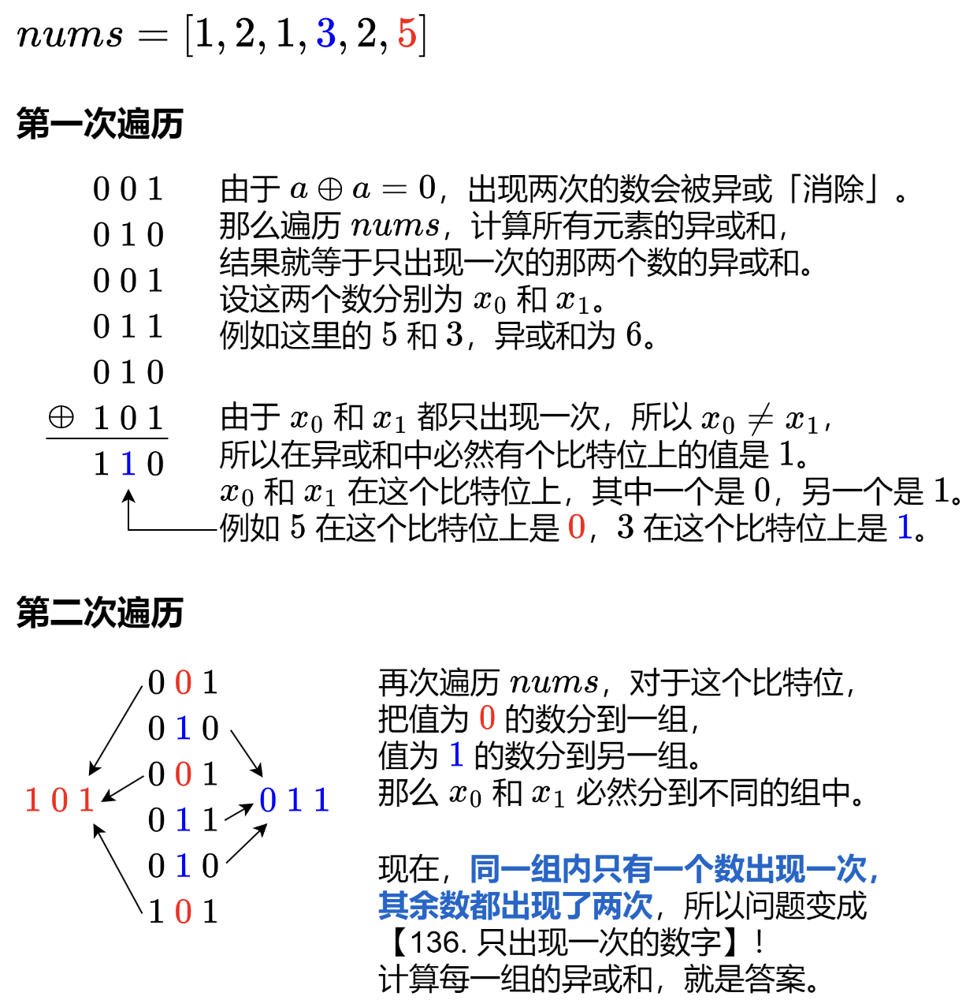

## 常见二进制操作

### 基本操作

```java
a = a ^ 0 = 0 ^ a
0 = a ^ a
# 基于上述可推出
a = a ^ b ^ b
```


### 两数交换

```java
a = a ^ b
b = a ^ b
a = a ^ b
```


### 移除最后一个1

```java
a = n & (n - 1)
  
# 举例
n     = 10 = 0 1 0 1 0
n - 1 =  9 = 0 1 0 0 1
&
      =  8 = 0 1 0 0 0 (10二进制形式中最后一个1移除完成)
```


### 获取最后一个1

```java
a = (n & (n - 1)) ^ n
  
# 举例
n     = 10 = 0 1 0 1 0
n - 1 =  9 = 0 1 0 0 1
&
      =  8 = 0 1 0 0 0 (10二进制形式中最后一个1移除完成)
n     = 10 = 0 1 0 1 0
^
      =  2 = 0 0 0 1 0 (10二进制形式中最后一个1获取成功)
```


### 获取二进制中最后一个值

```java
num = num & 1
```


## 例题

### [136. 只出现一次的数字](https://leetcode.cn/problems/single-number/)

> 相同元素异或之后，结果为0，任何数异或0结果为自身

```java
class Solution {
    public int singleNumber(int[] nums) {
        int res = 0;
        for (int num : nums) {
            res ^= num;
        }   
        return res;
    }
}
```


### [137. 只出现一次的数字 II](https://leetcode.cn/problems/single-number-ii/)

> ```java
> for (int i = 0; i < 32; i++){
>     res <<= 1;
>     res |= counts[31-i]%m;
> }
> return res;
> ```
>
> 快速构造32位二进制数逐步拼接成一个完整的整数，从最高开始算起

```java
class Solution {
    public int singleNumber(int[] nums) {
        // 32 
        int[] counts = new int[32];
        for (int num :nums){
            for(int j = 0; j < 32; j++){
                counts[j] += num&1;
                num>>>=1;
            }
        }
        // [1, 3, 1]
        int res = 0;
        int m = 3;
        for (int i = 0; i < 32; i++){
            res <<= 1;
            res |= counts[31-i]%m;
        }
        return res;
    }
}
```


### [260. 只出现一次的数字 III](https://leetcode.cn/problems/single-number-iii/)

> 

```java
class Solution {
    public int[] singleNumber(int[] nums) {
        // 思路：两个不同元素为x，y整体进行位运算，最终结果为 x ^ y
        // x ^ y 的结果，找到第一个二进制中的1对应10进制结果为div，这是两个数字二进制中第一个分歧点
        // 整个数组重新与div与运算，只有两种情况 所有元素被划分为2组，每组中有一个不重复的元素，其余元素重复2次
        int rst = 0;
        for (int num : nums) {
            rst ^= num;
        }
        int div = 1;
        while ((div & rst) == 0) {
            div <<= 1;
        }

        int a = 0;
        int b = 0;
        for (int num : nums) {
            if ((num & div) == 0) {
                b ^= num;
            } else {
                a ^= num;
            }
        }
        return new int[]{a, b};
    }
}
```

### [190. 颠倒二进制位](https://leetcode.cn/problems/reverse-bits/)

```java
public class Solution {
    // 先获取最后一位，然后再将最后一位移到结果的最高位
    public int reverseBits(int n) {
        int res = 0;
        for (int i = 0; i < 32; i++) {
            int cur = (n >> i) & 1;
            res |= (cur << (31 - i));
        }
        return res;
    }
}
```


### [191. 位1的个数](https://leetcode.cn/problems/number-of-1-bits/)

```java
class Solution {
    public int hammingWeight(int n) {
        int count = 0;
        while (n > 0) {
            count += 1;
            n = (n & (n - 1));
        }
        return count;
    }
}
```


### [201. 数字范围按位与](https://leetcode.cn/problems/bitwise-and-of-numbers-range/)

> 距离说明：
>
> ```java
> 举例
> left=110010
> right=110110
>  
> 在 [left,right] 中的二进制数为
> 110010
> 110011
> 110100
> 110101
> 110110
>  
> 这些二进制数的公共前缀都是 110，对于后三位，由于包含了
> 110011
> 110100
>   
> 这两个数，所以后三位的 AND 一定是 0。所以答案是 110000。
> 
> 
> ```
>
> 也就是不停地对n进行移除最后一个1操作，知道n < m，即可得到最终的结果

```java
class Solution {
    // 0和任何数相&均为0
    // 1和任何数相&为其本身
    // 题中给定的是 < Integer.MAX_VALUE
    public int rangeBitwiseAnd(int m, int n) {
        int shift = 0;
        // 找到公共前缀
       while(m < n){
           n = n & (n-1);
       }
       return n;
    }
}
```


