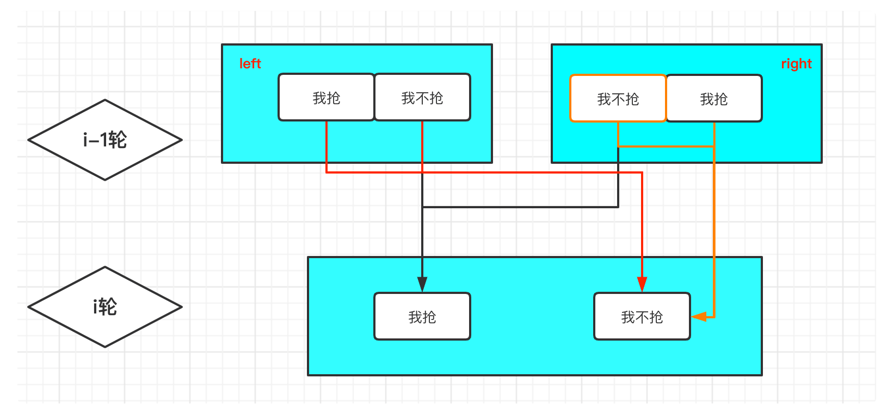
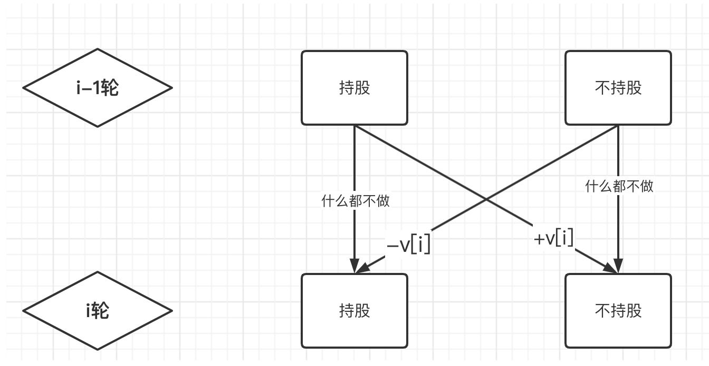
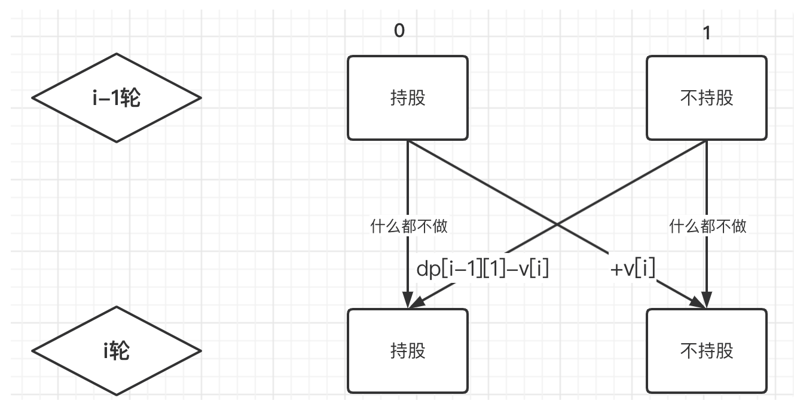
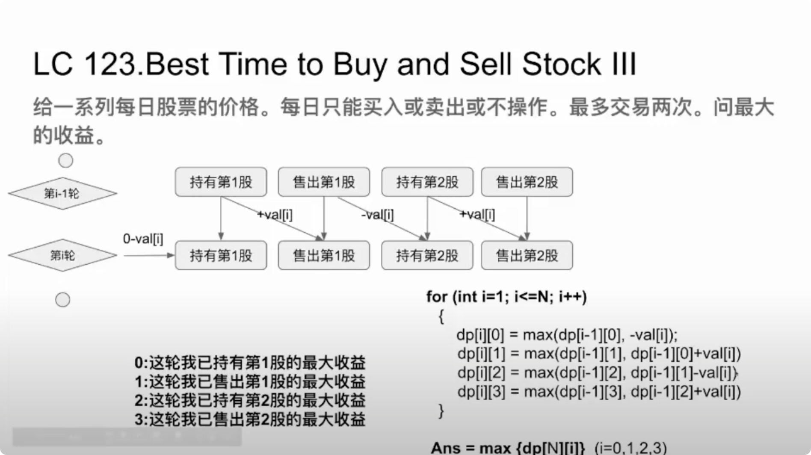
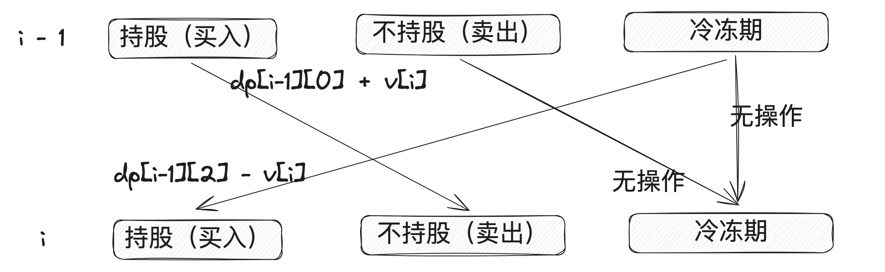
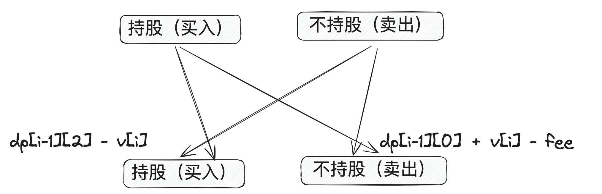

## 时间序列模型

### [198. 打家劫舍](https://leetcode-cn.com/problems/house-robber) :white_check_mark:

> 时间序列模型：其中每一个元素可以认为一天，并且**今天**的状态只取决于**昨天**的状态
>
> 1. 定于状态$dp[i][j]$ 表示第i家，偷或不偷 $j\in \{0,1\}, i \in \{N_i\}$
>
> 2. 转移方程
>
>    
>
>    * $ dp[i][j]=\left\{ \begin{array}{rcl} dp[i][0]= dp[i-1][1] + val[i] && {偷}\\ dp[i][1]=Math.max(dp[i-1][0], dp[i-1][1]) &&{不偷}\end{array} \right. $

```java
class Solution {
    public int rob(int[] nums) {
        int n = nums.length;
        // 0 偷
        // 1 不偷
        int[][] dp = new int[n][2];
        dp[0][0] = nums[0];
        for (int i = 1; i < n; i++) {
            // 第i家，偷
            dp[i][0] = dp[i - 1][1] + nums[i];
            dp[i][1] = Math.max(dp[i - 1][0], dp[i - 1][1]);
        }
        return Math.max(dp[n - 1][0], dp[n - 1][1]);
    }
}
```

### [213.  打家劫舍 II](https://leetcode-cn.com/problems/house-robber-ii) :white_check_mark:

> 环形偷，将环形拆开，分类讨论
>
> - 从 0 - (n - 2)
> - 从1 -  (n - 1)

```java
class Solution {
    public int rob(int[] nums) {
        // 环形
        int n = nums.length;
        if (n == 1) {
            return nums[0];
        }
        int startMax = rob(nums, 0, n - 2);
        int secondMax = rob(nums, 1, n - 1);
        return Math.max(startMax, secondMax);
    }

    private int rob(int[] nums, int left, int right) {
        int n = right - left + 1;
        int[][] dp = new int[n][2];
        // 0 偷 1 不偷
        dp[0][0] = nums[left];
        for (int i = left + 1; i <= right; i++) {
            dp[i - left][0] = dp[i - left - 1][1] + nums[i];
            dp[i - left][1] = Math.max(dp[i - left - 1][0], dp[i - left - 1][1]);
        }
        return Math.max(dp[n - 1][0], dp[n - 1][1]);
    }
}
```

### [337. 打家劫舍 III](https://leetcode-cn.com/problems/house-robber-iii) :white_check_mark:

> 树上偷
>
> 
>
> $ array_i[2]=\left\{ \begin{array}{rcl}array_i[0]=array_{left}[1] + array_{right}[1] + root.val  && {偷}\\ array[1]=Max(array_{left}[0], array_{right}[1]) + Max(arry_{right}[0], aray_{right}[1]) &&{不偷}\end{array} \right. $

```java
class Solution {
    public int rob(TreeNode root) {
        int[] res = postOrder(root);
        return Math.max(res[0], res[1]);
    }

    private int[] postOrder(TreeNode root) {
        if (root == null) {
            return new int[2];
        }
        // 0 偷  1 不偷
        int[] left = postOrder(root.left);
        int[] right = postOrder(root.right);
        int[] arr = new int[2];
        // 偷root.val情况
        int rootVal = root.val + left[1] + right[1];
        // 不偷roo.val情况
        int notRootVal = Math.max(left[0], left[1]) + Math.max(right[0], right[1]);
        return new int[] {rootVal, notRootVal};
    }
}
```

### [121. 买卖股票的最佳时机](https://leetcode-cn.com/problems/best-time-to-buy-and-sell-stock/) :white_check_mark:

> 买卖股票有约束，根据题目意思，有以下两个约束条件：
>
> - 条件 1：你不能在买入股票前卖出股票；
> - 条件 2：最多只允许完成一笔交易。
>
> 因此 **当天是否持股** 是一个很重要的因素，而当前是否持股和**昨天是否持股有关系**，所以也为时间序列模型
>
> <u>若是昨天不持股，今天持股，则和第一天持股一个道理，当前的金额数量为$-v[i]$</u> ，最后我们只需要返回最后一天不持股的最大金额数量即可。
>
> 
>
> $ dp[i][2]=\left\{ \begin{array}{rcl}dp[i][0]= Max(dp[i-1][0], -v[i]])  && {持股}\\ dp[i][1]=Max(dp[i-1][0] + v[i], dp[i-1][1]) &&{不持股}\end{array} \right. $

```java
class Solution {
    public int maxProfit(int[] prices) {
        int n = prices.length;
        // 0 持股 -prices[i]
        // 1 不持股 + prices[i]
        int[][] dp = new int[n][2];
        dp[0][0] = -prices[0];
        dp[0][1] = 0;
        for (int i = 1; i < n; i++) {
            dp[i][0] = Math.max(dp[i - 1][0], -prices[i]);
            dp[i][1] = Math.max(dp[i - 1][0] + prices[i], dp[i - 1][1]);
        }
        return dp[n - 1][1];
    }
}
```

### [剑指 Offer 63. 股票的最大利润](https://leetcode-cn.com/problems/gu-piao-de-zui-da-li-run-lcof/) :white_check_mark:

> 和上题一致

```java
class Solution {
    public int bestTiming(int[] prices) {
        int n = prices.length;
        int[][] dp = new int[n][2];
        if (n == 0) {
            return 0;
        }
        dp[0][0] = -prices[0];
        
        for (int i = 1; i < n; i++) {
            dp[i][0] = Math.max(dp[i - 1][0], - prices[i]);
            dp[i][1] = Math.max(dp[i - 1][0] + prices[i], dp[i - 1][1]);
        }
        return dp[n - 1][1];
    }
}
```


### [122. 买卖股票的最佳时机 II](https://leetcode-cn.com/problems/best-time-to-buy-and-sell-stock-ii/) :white_check_mark:

> 一天最多支持一次交易 （售出、买入）
>
> $ dp[i][2]=\left\{ \begin{array}{rcl}dp[i][0]= Max(dp[i-1][0], dp[i-1][1]-v[i]])  && {持股}\\ dp[i][1]=Max(dp[i-1][0] + v[i], dp[i-1][1]) &&{不持股}\end{array} \right. $
>
> 

```java
class Solution {
    public int maxProfit(int[] prices) {
        int n = prices.length;
        // 0 持股 1 不持股
        int[][] dp = new int[n][2];
        dp[0][0] = -prices[0];
        dp[0][1] = 0;
        for (int i = 1; i < n; i++) {
            dp[i][0] = Math.max(dp[i - 1][0], dp[i - 1][1] - prices[i]);
            dp[i][1] = Math.max(dp[i - 1][0] + prices[i], dp[i - 1][1]);
        }
        return dp[n - 1][1];
    }
}
```


### [123. 买卖股票的最佳时机 III](https://leetcode-cn.com/problems/best-time-to-buy-and-sell-stock-iii/):white_check_mark:

> 最高持有两股，分为四种状态，<u>注意第一只股票，售出之后，再买入，相当于直接-val[i];</u>
>
> 1. $ dp[i][j]=\left\{ \begin{array}{rcl} dp[i][0] = Max(dp[i-1][0], -val[i]) && {第i天，持第有1股的最大利润}\\ dp[i][1]=Max(dp[i-1][1], dp[i-1][0] + val[i]) && {第i天，售出第1股的最大收益} \\dp[i][2] = Max(dp[i-1][2], dp[i-1][1] - val[i] && {第i天，持有第2股的最大收益} \\dp[i][3] = Max(dp[i-1][3], dp[i-1][2] + val[i]) && {第i天，售出第2股的最大收益} \end{array} \right. $ 
>
> 最后的结果为$Max\{dp[N][i]\} (i = 0, 1, 2, 3)$
>
> 

```java
class Solution {
    public int maxProfit(int[] prices) {
        int n = prices.length;
        // 0 持有第一股
        // 1 售出第一股
        // 2 持有第二股
        // 3 售出第二股
        int[][] dp = new int[n][4];
        dp[0][0] = -prices[0];
        dp[0][1] = 0;
        dp[0][2] = -prices[0];
        dp[0][3] = 0;
        for (int i = 1; i < n; i++) {
            dp[i][0] =  Math.max(dp[i - 1][0], -prices[i]);
            dp[i][1] = Math.max(dp[i - 1][0] + prices[i], dp[i - 1][1]);
            dp[i][2] = Math.max(dp[i - 1][1] - prices[i], dp[i - 1][2]);
            dp[i][3] = Math.max(dp[i - 1][2] + prices[i], dp[i - 1][3]);
        }
        int res = 0;
        for (int i = 0; i < 4; i++) {
            res = Math.max(dp[n - 1][i], res);
        }
        return res;
    }
}
```


### [188. 买卖股票的最佳时机 IV](https://leetcode-cn.com/problems/best-time-to-buy-and-sell-stock-iv/):white_check_mark:

> 123题的通用版，偶数位为持有股票，奇数位为售出股票
>
> 

```java
class Solution {
    public int maxProfit(int k, int[] prices) {
        int n = prices.length;
        int[][] dp = new int[n][2 * k];
        // 偶数位为持有第k只股票 奇数位为售出当前股票
        for (int i = 0; i < 2 * k; i++) {
            if (i % 2 == 0) {
                dp[0][i] = -prices[0];
            }
        }
        
        for (int i = 1; i < n; i++) {
            for (int j = 0; j < 2 * k; j++) {
                // 奇数 售出
                if (j % 2 == 1) {
                    dp[i][j] = Math.max(dp[i - 1][j - 1] + prices[i], dp[i - 1][j]);
                } else {
                    if (j == 0) {
                        dp[i][j] = Math.max(dp[i - 1][j], -prices[i]);
                    }  else {
                        dp[i][j] = Math.max(dp[i - 1][j - 1] - prices[i], dp[i - 1][j]);
                    }
                }
            }
        }
        int res = 0;
        for (int i = 0; i < 2 * k; i++) {
            res = Math.max(dp[n - 1][i], res);
        }
        return res;
    }
}
```


### [309. 最佳买卖股票时机含冷冻期](https://leetcode-cn.com/problems/best-time-to-buy-and-sell-stock-with-cooldown/) :white_check_mark:

> 

```java
class Solution {
    public int maxProfit(int[] prices) {
        int n = prices.length;
        int[][] dp = new int[n][3];
        // 0 持股买入
        // 1 不持股 卖出
        // 2 冷冻
        dp[0][0] = -prices[0];
        for (int i = 1; i < n; i++) {
            dp[i][0] = Math.max(dp[i - 1][0], dp[i - 1][2] - prices[i]);
            dp[i][1] = Math.max(dp[i - 1][0] + prices[i], dp[i - 1][1]);
            dp[i][2] = Math.max(dp[i - 1][1], dp[i - 1][2]);
        }

        int res = 0;
        for (int i = 0; i < 3; i++) {
            res = Math.max(dp[n - 1][i], res);
        }
        return res;
    }
}
```


### [714. 买卖股票的最佳时机含手续费](https://leetcode-cn.com/problems/best-time-to-buy-and-sell-stock-with-transaction-fee/) :white_check_mark:

> 122 一样的道理，只不过是增加了手续费
>
> 

```java
class Solution {
    public int maxProfit(int[] prices, int fee) {
        int n = prices.length;
        int[][] dp = new int[n][2];
        // 0 买入
        // 1 卖出
        dp[0][0] = -prices[0];
        for (int i = 1; i < n; i++) {
            dp[i][0] = Math.max(dp[i - 1][0], dp[i - 1][1] - prices[i]);
            dp[i][1] = Math.max(dp[i - 1][0] + prices[i] - fee, dp[i - 1][1]);
        }
        return Math.max(dp[n - 1][0], dp[n - 1][1]);
    }
}
```

1. [376. 摆动序列](https://leetcode-cn.com/problems/wiggle-subsequence/)
2. [487. 最大连续1的个数 II](https://leetcode-cn.com/problems/max-consecutive-ones-ii/):white_check_mark:
3. [1186. 删除一次得到子数组最大和](https://leetcode-cn.com/problems/maximum-subarray-sum-with-one-deletion/):white_check_mark:


## 时间序列增强版（子序列模型）

> 子序列、子数组问题

### [139. 单词拆分](https://leetcode.cn/problems/word-break/)

> 子序列，当前位置与之前所有位置有关

```java
class Solution {
    public boolean wordBreak(String s, List<String> wordDict) {
        int n = s.length();
        // 到第i个位置，s.substring(0, i + 1) 是否能够通过wordDict构成
        boolean[] dp = new boolean[n + 1];
        dp[0] = true;
        for (int i = 1; i <= n; i++) {
            for (int j = 0; j < i; j++) {
                String sub = s.substring(j, i);
                if (dp[j] && wordDict.contains(sub)) {
                    dp[i] = true;
                }
            }
        }
        return dp[n];
    }
}
```

### [300. 最长递增子序列](https://leetcode.cn/problems/longest-increasing-subsequence/)

> 子序列问题

```java
class Solution {
    public int lengthOfLIS(int[] nums) {
        int n = nums.length;
        int[] dp = new int[n];
        Arrays.fill(dp, 1);
        for (int i = 1; i < n; i++) {
            for (int j = 0; j < i; j++) {
                if (nums[i] <= nums[j]) {
                    continue;
                }
                dp[i] = Math.max(dp[i], dp[j] + 1);
            }
        }
        return Arrays.stream(dp).max().getAsInt();
    }
}
```


### [322. 零钱兑换](https://leetcode.cn/problems/coin-change/)

> 子序列的变化
>
> - 注意，dp[i] 默认为兑换不了，dp[0] 根据题意可设置为0，如果不设置的话，需要在for循环内设置
>
> 求最少的兑换结果

```java
class Solution {
    public int coinChange(int[] coins, int amount) {
        // 零钱i 最小的兑换结果
        int[] dp = new int[amount + 1];
        dp[0] = 0;
        for (int i = 1; i <= amount; i++) {
            dp[i] = Integer.MAX_VALUE;
            for (int coin : coins) {
                if (i - coin == 0) {
                    dp[i] = 1;
                }
                if (i - coin < 0 || dp[i - coin] == Integer.MAX_VALUE) {
                    continue;
                }
                dp[i] = Math.min(dp[i], dp[i - coin] + 1);
            }
        }   
        return dp[amount] == Integer.MAX_VALUE ? -1 : dp[amount];
    }
}
```


### [53. 最大子数组和](https://leetcode.cn/problems/maximum-subarray/)

> 子数组，出现异常情况，当前值作为新的dp[i]

```java
class Solution {
    public int maxSubArray(int[] nums) {
        int n = nums.length;
        int[] dp = new int[n];
        dp[0] = nums[0];
        for (int i = 1; i < n; i++) {
            dp[i] = Math.max(dp[i - 1] + nums[i], nums[i]);
        }
        return Arrays.stream(dp).max().getAsInt();
    }
}
```


### [152. 乘积最大子数组](https://leetcode.cn/problems/maximum-product-subarray/)

> 子数组 需要考虑负数情况

```java
class Solution {
    public int maxProduct(int[] nums) {
        int len = nums.length;
        int[] max = new int[len];
        int[] min = new int[len];
        System.arraycopy(nums, 0, max, 0, len);
        System.arraycopy(nums, 0, min, 0, len);
        max[0] = nums[0];
        min[0] = nums[0];
        int res = nums[0];
        for (int i = 1; i < len; i++) {
            max[i] = Math.max(max[i], Math.max(max[i-1] * nums[i], min[i-1] * nums[i]));
            min[i] = Math.min(min[i], Math.min(max[i-1] * nums[i], min[i-1] * nums[i]));
            res = Math.max(res, max[i]);
        }
        return res;
    }
}
```


## 双序列

> 给出两个序列$S$和$T$ (数组、字符串)，对它们两个搞事情
>
> - 编辑距离

### [72. 编辑距离](https://leetcode.cn/problems/edit-distance/)

> 1. 定义状态:
>
>    $dp[i][j]$ 表示A的前i个字符到B的前j个字符之间的编辑距离
>
> 2. 寻找状态转移方程
>
>    我觉得二维的状态, 画在纸上更加的简单明了
>
>    
>
>    
>
>    
>
>    1. $dp[0][j]$表示一个空字符串A到B的前j个字符之间的距离
>    2. $dp[i][0]$表示一个空字符串B到字符串A的前i个字符之间的距离
>    3. $d[i,j]=min(d[i-1,j]+1 、d[i,j-1]+1、d[i-1,j-1]+temp)$ 这三个当中的最小值
>       1. $str1[i] == str2[j]$，表示相同, 用temp记录它，为0。否则temp记为1
>       2. $dp[i-1][j]$ 表示增加操作
>       3. $dp[i][j-1]$表示删除操作
>       4. $dp[i-1][j-1] + temp$表示替换操作
>
> 3. 边界值
>
>    1. $dp[i][0]$
>    2. $dp[0][j]$

```java
class Solution {
    public int minDistance(String word1, String word2) {
        int n = word1.length();
        int m = word2.length();
        int[][] dp = new int[n + 1][m + 1];
        for (int i = 1 ; i <= n; i++) {
            dp[i][0] = dp[i - 1][0] + 1; 
        }
        for (int i = 1; i <= m; i++) {
            dp[0][i] = dp[0][i - 1] + 1;
        }
        int tmp = 0;
        for (int i = 1; i <= n; i++) {
            for (int j = 1; j <= m; j++) {
                if (word1.charAt(i - 1) == word2.charAt(j - 1)) {
                    tmp = 0;
                } else {
                    tmp = 1;
                }
                dp[i][j] = Math.min(dp[i - 1][j - 1] + tmp, Math.min(dp[i - 1][j], dp[i][j - 1]) + 1);
            }
        }

        return dp[n][m];
        
    }
}
```


### [1143. 最长公共子序列](https://leetcode.cn/problems/longest-common-subsequence/)

> 更上题一致，为了方便处理，同一添加""

```java
class Solution {
    public int longestCommonSubsequence(String s1, String s2) {
        int n = s1.length(), m = s2.length();
        s1 = " " + s1; s2 = " " + s2;
        char[] cs1 = s1.toCharArray(), cs2 = s2.toCharArray();
        int[][] f = new int[n + 1][m + 1]; 
        for (int i = 1; i <= n; i++) {
            for (int j = 1; j <= m; j++) {
                if (cs1[i] == cs2[j]) f[i][j] = f[i -1][j - 1] + 1;    
                else f[i][j] = Math.max(f[i - 1][j], f[i][j - 1]);
            }
        }
        return f[n][m];
    }
}
```

### [718. 最长重复子数组](https://leetcode.cn/problems/maximum-length-of-repeated-subarray/)

```java
class Solution {
    public int findLength(int[] nums1, int[] nums2) {
        int len1 = nums1.length;
        int len2 = nums2.length;
        int[][] dp = new int[len1][len2];
        // 
        // if nums1[i] == nums2[j]  dp[i][j] = math.max(dp[i-1][j], dp[i-1][j-1] + 1, dp[i][j-1]);
        int max = 0;
        for (int i = 0; i < len1; i++) {
            if (nums1[i] == nums2[0]) {
                dp[i][0] = 1;
                max = Math.max(max, dp[i][0]);
            }
        }

        for (int i = 0; i < len2; i++) {
            if (nums2[i] == nums1[0]) {
                dp[0][i] = 1;
                max = Math.max(max, dp[0][i]);
            }
        }

        for (int i = 1; i < len1; i++) {
            for (int j = 1; j < len2; j++) {
                if (nums1[i] == nums2[j]) {
                    dp[i][j] = dp[i-1][j-1] + 1;
                    max = Math.max(dp[i][j], max);
                }
            }
        }
        return max;
    }
}
```


## 区间序列


## 背包

### [518. 零钱兑换 II](https://leetcode.cn/problems/coin-change-ii/)

> 求兑换的组合，改成背包模型

```java
class Solution {
    public static int change(int amount, int[] coins) {
        int n = coins.length;
        int[][] dp = new int[n + 1][amount + 1];
        for (int i = 0; i <= n; i++) {
            dp[i][0] = 1;
        }
        for (int i = 1; i <= n; i++) {
            int coin = coins[i - 1];
            for (int j = 1; j <= amount; j++) {
                //不选第i个硬币
                dp[i][j] = dp[i - 1][j];
                //选择第i个硬币
                if (j >= coin) {
                    dp[i][j] += dp[i][j - coin];
                }
            }
        }
        return dp[n][amount];
    }
}
```


## 二维数组

### [221. 最大正方形](https://leetcode.cn/problems/maximal-square/)

```java
class Solution {
    public int maximalSquare(char[][] matrix) {
        int rows = matrix.length;
        int cols = matrix[0].length;
        int[][] dp = new int[rows][cols];
        int max = 0;
        // dp[i][j] (i,j)为右下角是，能够成最大的边长
        for (int i = 0; i < rows; i++) {
            if (matrix[i][0] == '1') {
                dp[i][0] = 1;
                max = Math.max(dp[i][0], max);
            }
        }

        for (int i = 0; i < cols; i++) {
            if (matrix[0][i] == '1') {
                dp[0][i] = 1;
                max = Math.max(dp[0][i], max);
            }
            
        }
        for (int i = 1; i < rows; i++) {
            for (int j = 1; j < cols; j++) {
                if (matrix[i][j] == '1') {
                    int temp = Math.min(dp[i-1][j], dp[i][j-1]);
                    dp[i][j] = Math.min(temp, dp[i-1][j-1]) + 1;
                    max = Math.max(dp[i][j], max);
                }
            }
        }
        return max * max;

    }
}
```

### [64. 最小路径和](https://leetcode.cn/problems/minimum-path-sum/)

```java
class Solution {
    public int minPathSum(int[][] grid) {
        int row = grid.length;
        int col = grid[0].length;
        int[][] dp = new int[row][col];
        dp[0][0] = grid[0][0];
        for (int i = 1; i < row; i++) {
            dp[i][0] =  dp[i - 1][0] + grid[i][0];
        }   

        for (int i = 1; i < col; i++) {
            dp[0][i] = dp[0][i - 1] + grid[0][i];
        }

        for (int i = 1; i < row; i++) {
            for (int j = 1; j < col; j++) {
                dp[i][j] = Math.min(dp[i - 1][j], dp[i][j - 1]) + grid[i][j];
            }
        }
        return dp[row - 1][col - 1];
    }
}
```

